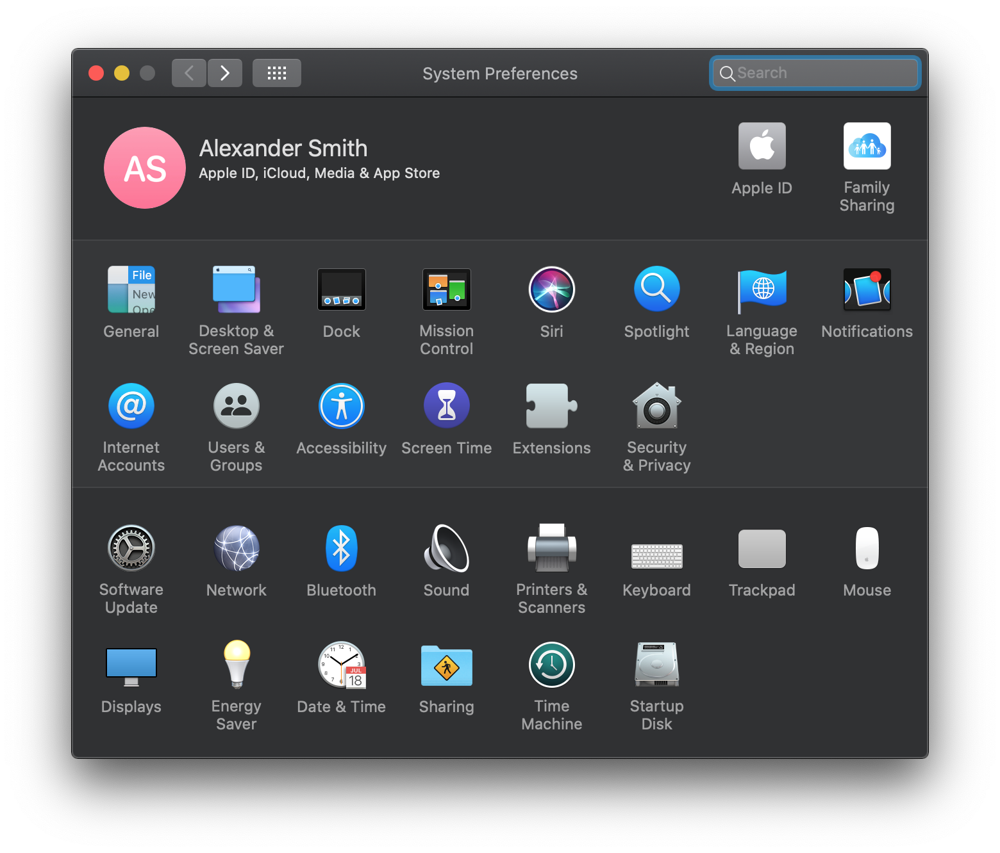
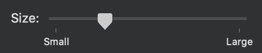
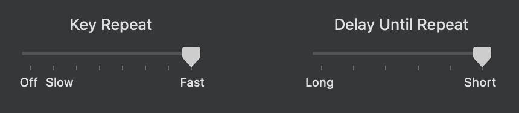
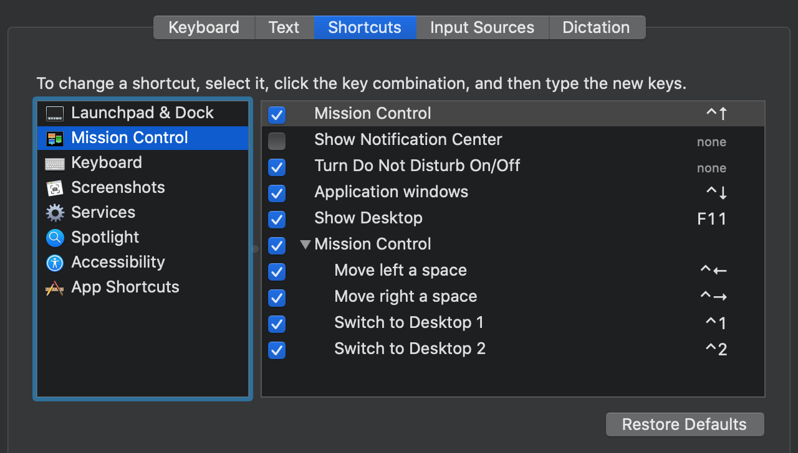
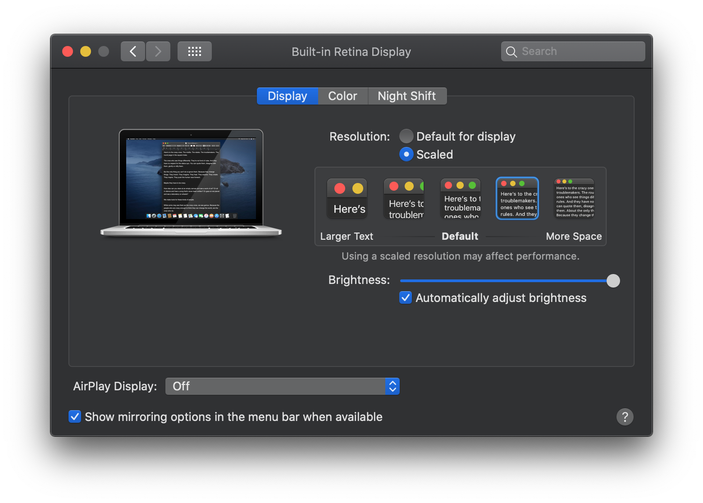

# My macOS Setup

Documents the steps necessary to install my macOS setup.  Most of the focus will be on command line tools.  This document is entirely opinionated to myself.  Feel free to borrow or detract from it as much as you'd like.

# System Preferences

<p align="center">
    
</p>

## General

1.  Set "Appearance" to "Dark".
2.  Set "Default web browser" to "Google Chrome".

## Dock

1.  Set "Size" to a reasonably small value.

<p align="center">
    
</p>

2.  Set "Minimize windows using" to "Scale effect".
3.  Enable "Automatically hide and show the Dock".

## Accessibility

1.  Enable "Use scroll gesture with modifier keys to zoom" under "Zoom".

## Security & Privacy

1.  Enable "Use your Apple Watch to unlock apps and your Mac" under "General".

## Keyboard

1.  Maximize speed for "Key Repeat" and minimize "Delay Until Repeat" under "Keyboard".

<p align="center">
    
</p>

2.  Add keyboard shortcuts to improve switching between desktops under "Shortcuts" -> "Mission Control":

<p align="center">
    
</p>

## Trackpad

1.  Enable "Tap to click" in "Point & Click".
2.  Disable "Scroll direction: Natural" in "Scroll & Zoom".

## Displays

1.  Increase scaled resolution: 

<p align="center">
    
</p>

# Applications

## Alfred

Alfred is an productivity and efficiency tool that mirrors and expands the capabilities of Spotlight. 

1.  Go to https://www.alfredapp.com/ and download Alfred.
2.  Install the app, following the steps in the installer.
3.  Open Alfred Preferences and set the following:
    * General -> Check "Launch Alfred at login".
    * General -> Set "Alfred Hotkey" to `CMD+Space`.
    * Appearance -> Set to "Alfred Dark".

## Spectacle

Spectacle is a windowing tool that supports moving and resizing windows via keyboard shortcuts.

1.  Go to https://www.spectacleapp.com/ and download Spectacle.
2.  Install the app, following the steps in the installer.
3.  Open Spectacle Preferences and set the following:
    * Set "Fullscreen" to `OPTION+CMD+F`.
    * Set "Left Half" to `CTRL+CMD+<-`.
    * Set "Right Half" to `CTRL+CMD+->`.
    * Enable "Launch Spectacle at login".

## iTerm2

iTerm2 is a feature-rich replacement for Terminal.

1.  Go to https://www.iterm2.com/ and download iTerm2.
2.  Install the app, following the steps in the installer.
3.  Download the "Afterglow" Color Preset from https://iterm2colorschemes.com/.
4.  Open iTerm2 Preferences and set the following:
    * Profiles -> General -> Set "Working Directory" to "Reuse previous..."
    * Profiles -> Colors ->  Import and use the "Afterglow" preset.
    * Profiles -> Terminal -> Enable "Unlimited scrollback"

# Shell

## zsh

[zsh](https://github.com/zsh-users/zsh) is a feature-rich shell with lots of features above and beyond the default bash shell.

Note: since macOS 10.15 Catalina, [zsh is the default shell](https://support.apple.com/en-us/HT208050) for your machine. For users created before their machine's upgrade to Catalina, they may still be using bash.

1.  Install Zsh:
    ```sh
    $ brew install zsh
    ```
2.  Step through first-time configuration and select the option which creates a blank `.zshrc` file:
    ```sh
    $ zsh
    ```
    > ...
    > <br>
    > (0)  Exit, creating the file ~/.zshrc containing just a comment.  That will prevent this function being run again.
    > <br>
    > ...
3.  Set `zsh` to be your preferred login shell:
    ```sh
    $ chsh -s $(which zsh)
    ```

If you exit and reload your terminal, it should load into zsh.

## Prezto

Install [Prezto](https://github.com/sorin-ionescu/prezto), a configuration framework for zsh that enriches the command line interface environment with defaults, aliases, functions, auto completion, and prompt themes.

1.  Install Prezto
    ```sh
    $ git clone --recursive https://github.com/sorin-ionescu/prezto.git "${ZDOTDIR:-$HOME}/.zprezto"
    ```
2.  Generate a new Zsh configuration by copying the files below:
    * First, delete the `.zshrc` file we generated above:
        ```sh
        $ rm -rf ~/.zshrc
        ```
    * And copy the preset configuration from Prezto:
        ```sh
        $ setopt EXTENDED_GLOB
        for rcfile in "${ZDOTDIR:-$HOME}"/.zprezto/runcoms/^README.md(.N); do
            ln -s "$rcfile" "${ZDOTDIR:-$HOME}/.${rcfile:t}"
        done
        ```
3.  Add some modules to your `.zpreztorc` config file:
    ```sh
    # Set the Prezto modules to load (browse modules).
    # The order matters.
    zstyle ':prezto:load' pmodule \
        'environment' \
        'terminal' \
        'editor' \
        'history' \
        'directory' \
        'spectrum' \
        'utility' \
        'completion' \
        'git' \
        'prompt' \
        'syntax-highlighting' \
        'history-substring-search'
    ```

If you exit and reload your terminal, it should load Prezto.

# Command line tools

## Volta

Volta is a viable alternative to nvm that simplifies version management for your tools.  Check it out at [volta.sh](http://volta.sh/):

1.  Install Volta:
    ```sh
    $ curl https://get.volta.sh | bash
    ```
2.  Install Node.js:
    ```sh
    $ volta install node
    ```
3.  Ensure that `node` is available:
    ```sh
    $ node --version
    ```

## git

### Installation

While Git is already be installed, it is possible that it is out of date. You can verify this by running `git --version`.

If your git is out of date, you can install an instance separate from the once that comes bundled from Apple.

1.  Install 
```sh
$ brew install git
$ brew link --overwrite git
```

In the future, we can upgrade with `brew upgrade git`.

### Configuration

Add some reasonable aliases:

1.  Open `~/.gitconfig`.
2.  Add some reasonable aliases to improve your developer experience:
    ```
    [alias]
        alias = !git config --list | grep 'alias' | sort
        co = !git checkout $* && echo "Checked out:"
        st = !git status
        cp = !git cherry-pick
        p = !git fetch --tags --all && git pull --rebase
        pp = !git p && git push
        last = !git log -1 HEAD
        wipe = !git clean -xfd && git reset HEAD --hard
    ```
3.  (Optional) Add some extra, less generalized options:
    ```
    [alias]
        pr = "!f() { git fetch -fu ${2:-$(git remote |grep ^upstream || echo origin)} refs/pull/$1/head:pr/$1 && git checkout pr/$1; }; f"
    
    [core]
        editor = code --wait
        excludesfile = /Users/amsmith/.gitignore
    ```

### GitHub integration

Follow the Mac steps outlined in GitHub's [Generating a new SSH key and adding it to the ssh-agent](https://help.github.com/en/articles/generating-a-new-ssh-key-and-adding-it-to-the-ssh-agent) guide.

## autojump

[autojump](https://github.com/wting/autojump) is a helpful shell utility to more quickly navigate your filesystem.

1.  Install autojump:
    ```sh
    $ brew install autojump
    ```

Try it out with `j <KEYWORD>`.

## Tig

[Tig](https://github.com/jonas/tig) is a text-mode interface for git.

1.  Install Tig:
    ```sh
    $ brew install tig
    ```

Try it out with `tig` while in a git repository.

## ripgrep

[ripgrep](https://github.com/BurntSushi/ripgrep) is a highly performant command-line oriented search tool similar to grep.

1.  Install ripgrep:
    ```sh
    $ brew install ripgrep
    ```

Try it out with `rg <PATTERN>`.

## fzf

[fzf](https://github.com/junegunn/fzf) is a general-purpose command-line fuzzy finder.

1.  Install fzf:
    ```sh
    $ brew install fzf
    ```
2.  (Optionally) Install useful key bindings and fuzzy completion:
    ```sh
    $ $(brew --prefix)/opt/fzf/install
    ```
    * Note: this will generate `~/.fzf.**` files and modify your `~/.bashrc` and `~/.zshrc`.
    * Check out https://github.com/junegunn/fzf/issues/62 if you run into issues with key bindings.

Try it out with `fzf`.

Note to safely uninstall, use the provided uninstall script:

    ```sh
    $ git clone git@github.com:junegunn/fzf.git
    $ cd fzf
    $ ./uninstall
    $ brew uninstall fzf
    ```